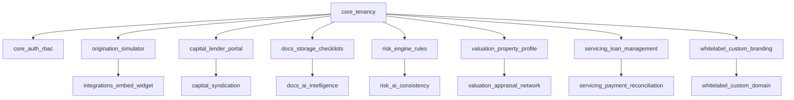

# HIPOTECALY — CATÁLOGO COMERCIAL DE ADD-ONS & EXPANSIONES (2026)

**Versión:** 1.0  
**Fecha:** Septiembre 2026  
**Fase:** Macrofase 5 (Modular SaaS Product Catalog & Entitlements)  
**Alcance:** Modelos de Pricing, Activación Progresiva, Valor Aportado y Dependencias Técnicas  

---

## 1. VISIÓN GENERAL

Los Add-ons de **HIPOTECALY** permiten a los clientes del SaaS (operadoras de crédito, estudios notariales, cooperativas y bancos) expandir las capacidades de su instancia base bajo un esquema modular y predecible.

Todos los Add-ons:
- Son **tenant-isolated**: su activación impacta exclusivamente a la organización contratante.
- Cuentan con verificación técnica de dependencias previas mediante [`moduleCatalogService.ts`](src/lib/moduleCatalogService.ts).
- Integran telemetría y medición de consumo mediante [`usageMeteringService.ts`](src/lib/usageMeteringService.ts).

---

## 2. CATÁLOGO DETALLADO DE ADD-ONS

### ADD-ON 1: Sindicación Multi-Inversor & Tranches (`capital_syndication`)
- **Categoría:** Capital & Marketplace
- **Dependencia Requerida:** `capital_lender_portal`
- **Propuesta de Valor:** Permite estructurar operaciones de crédito donde múltiples inversores privados o institucionales fondean una misma hipoteca en tramos porcentuales específicos, automatizando la distribución de intereses y la reportería individual.
- **Modelo de Pricing:** Tarifa mensual adicional o fee por volumen sindicado (BPS).
- **Métricas de Consumo:** Número de tranches estructurados, inversores participantes.

---

### ADD-ON 2: Document Intelligence Asistivo (`docs_ai_intelligence`)
- **Categoría:** Documents & AI
- **Dependencia Requerida:** `docs_storage_checklists`
- **Propuesta de Valor:** Análisis automatizado de títulos de propiedad, cédulas catastrales, recibos de ingresos y poderes notariales. Extrae datos clave, alerta sobre discrepancias de padrón o titularidad y reduce en más del 70% el tiempo manual de pre-evaluación.
- **Modelo de Pricing:** Pack mensual de análisis de documentos incluidos + tarifa por documento excedente.
- **Métricas de Consumo:** `ai_documents_analyzed`.

---

### ADD-ON 3: Risk & Consistency Copilot (`risk_ai_consistency`)
- **Categoría:** Risk & AI
- **Dependencia Requerida:** `risk_engine_rules`
- **Propuesta de Valor:** Motor de inteligencia operativa que audita de forma cruzada la coherencia de la solicitud: cruce entre ingresos netos declarados vs. estados bancarios, relación cuota/ingreso (DTI), exposición geográfica del colateral y scoring predictivo asistido.
- **Modelo de Pricing:** Tarifa plana por plan o fee por expediente evaluado.
- **Métricas de Consumo:** `ai_risk_evaluations`.

---

### ADD-ON 4: Red y Módulo de Tasaciones Periciales (`valuation_appraisal_network`)
- **Categoría:** Valuation & Colateral
- **Dependencia Requerida:** `valuation_property_profile`
- **Propuesta de Valor:** Flujo formal de asignación pericial a peritos tasadores o tasadores asociados, recepción del informe estructurado, validación fotográfica y ajuste vinculante del LTV del expediente.
- **Modelo de Pricing:** Fee por peritaje tramitado o cuota mensual del módulo.
- **Métricas de Consumo:** `appraisals_processed`.

---

### ADD-ON 5: Loan Servicing & Calendario de Cuotas (`servicing_loan_management`)
- **Categoría:** Servicing Post-Cierre
- **Dependencia Requerida:** `core_tenancy`
- **Propuesta de Valor:** Transición automática del expediente una vez firmado a cartera activa. Genera cronogramas de amortización bajo sistema Francés, Alemán o Bullet/Interés Puro, cálculo de mora, devengamiento diario y estados de cuenta para el deudor y acreedor.
- **Modelo de Pricing:** Fee mensual según cartera de créditos activos bajo administración.
- **Métricas de Consumo:** `active_loans_under_management`.

---

### ADD-ON 6: Conciliación de Comprobantes & Pagos (`servicing_payment_reconciliation`)
- **Categoría:** Payments & Servicing
- **Dependencia Requerida:** `servicing_loan_management`
- **Propuesta de Valor:** Carga ágil de transferencias bancarias o cupones de cobranza, validación contra las cuotas devengadas, split de liquidación a los prestamistas y emisión de recibos digitales.
- **Modelo de Pricing:** Add-on complementario a Loan Servicing.
- **Métricas de Consumo:** `reconciled_transactions`.

---

### ADD-ON 7: Dominio Personalizado & Certificado SSL (`whitelabel_custom_domain`)
- **Categoría:** White-Label
- **Dependencia Requerida:** `whitelabel_custom_branding`
- **Propuesta de Valor:** Permite desplegar el portal de originación bajo el propio subdominio o dominio institucional del cliente (ej. `portal.financierax.com.uy`) con aprovisionamiento automático de certificados TLS/SSL y eliminación completa de referencias externas.
- **Modelo de Pricing:** Setup fee único + mantenimiento anual de infraestructura dedicada.
- **Métricas de Consumo:** Dominios activos por tenant.

---

### ADD-ON 8: Tableros de Métricas & Analítica Avanzada (`analytics_advanced_reporting`)
- **Categoría:** Analytics & BI
- **Dependencia Requerida:** `core_tenancy`
- **Propuesta de Valor:** Visores ejecutivos y analíticos en tiempo real: volumen total originado (TVL), ticket promedio, tasa media ponderada, tiempo de ciclo desde solicitud hasta desembolso, distribución de garantías por departamento y embudo de conversión de leads.
- **Modelo de Pricing:** Incluido en planes Platform/Enterprise o add-on para Professional.
- **Métricas de Consumo:** Reportes generados / exportaciones periódicas.

---

## 3. RESUMEN DE MATRIZ DE DEPENDENCIAS

Cada activación valida en tiempo de ejecución este árbol mediante [`canEnableModule(tenantId, moduleId)`](src/lib/moduleCatalogService.ts).
