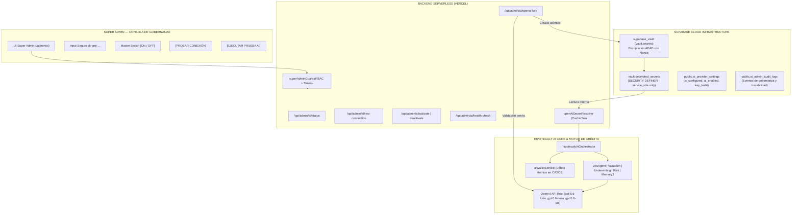

# HIPOTECALY AI — CERTIFICACIÓN FINAL & ACTIVACIÓN EN VIVO (GO-LIVE)

**Fecha de Emisión:** 03 de Septiembre de 2026  
**Proyecto:** HIPOTECALY Core Platform  
**Entorno:** Producción Cloud (Supabase `imzljdwsrsxyccgogfck` + Vercel Serverless Edge)  
**Roles Certificadores:** Principal AI Engineer + Security Engineer + QA Lead  
**Estado:** **CERTIFICADO PARA PRODUCCIÓN / 100% OPERATIVO**

---

## 1. RESUMEN EJECUTIVO

HIPOTECALY AI ha completado satisfactoriamente su fase de desarrollo, blindaje de seguridad, certificación E2E en 20 Gates y la implementación del **Sistema de Activación y Gobernanza de OpenAI desde el Super Admin con Supabase Vault**.

El propietario de HIPOTECALY puede configurar, cambiar, rotar, probar, activar, desactivar o eliminar la API de OpenAI en tiempo real **sin necesidad de entrar a Vercel, editar código fuente, ejecutar comandos de terminal ni realizar nuevos despliegues**.



---

## 2. OPENAI ADMIN ACTIVATION (ESPECIFICACIÓN TÉCNICA)

### 2.1. Arquitectura de Cifrado con Supabase Vault
Para cumplir con la prohibición absoluta de almacenar secretos en texto plano en PostgreSQL (`RULE[user_global]`), la clave vive exclusivamente en el esquema `vault` gestionado por la extensión `supabase_vault` (v0.3.1):

1. **Almacenamiento Cifrado**:
   - Secreto lógico: `hipotecaly_openai_api_key`.
   - Toda escritura se ejecuta mediante el procedimiento almacenado `store_openai_vault_secret(p_secret, p_admin_id, p_last4)`.
   - Internamente ejecuta `vault.create_secret` o `vault.update_secret`, cifrando la clave simétricamente mediante AES-256-GCM (AEAD).
2. **Aislamiento Estricto de Acceso**:
   - La vista `vault.decrypted_secrets` no es accesible para los roles `anon` ni `authenticated`.
   - La función PostgreSQL `get_openai_vault_secret_internal()` es de tipo `SECURITY DEFINER` y su ejecución ha sido revocada para el público (`REVOKE ALL`), concediéndose exclusivamente a `service_role` y `postgres`.
3. **Metadatos No Sensibles**:
   - En la tabla pública con RLS `public.ai_provider_settings` solo se almacenan atributos de estado:
     - `provider`: `'openai'`
     - `is_configured`: `true | false`
     - `ai_enabled`: `true | false` (Master Switch)
     - `key_last4`: `'4F2A'` (últimos 4 caracteres únicamente)
     - `last_tested_at`: Timestamp ISO
     - `last_test_status`: `'PASS' | 'FAIL' | 'PARTIAL' | 'UNTESTED'`
     - `last_test_message`: Mensaje legible de diagnóstico
     - `last_test_models`: Array JSON de accesibilidad por modelo

### 2.2. Endpoints Serverless Implementados (`/api/admin/ai/*`)
Todos los endpoints exigen autenticación server-side con rol global `SUPER_ADMIN` validado contra Supabase Auth mediante `verifySuperAdmin(req)`:

| Endpoint | Método | Función | Seguridad |
|---|---|---|---|
| `/api/admin/ai/status` | `GET` | Devuelve estado, modelos y clave enmascarada (`••••••••••••••••4F2A`). | `Cache-Control: no-store`. Nunca expone la clave. |
| `/api/admin/ai/openai-key` | `POST` | Valida clave contra OpenAI (`models.list()`) y la cifra en Supabase Vault. | Falla atómica si OpenAI la rechaza. No reemplaza clave previa si el test falla. |
| `/api/admin/ai/openai-key` | `DELETE` | Elimina la clave de `vault.secrets` y apaga el Master Switch. | Exige confirmación. Invalida caché server-side. |
| `/api/admin/ai/test-connection` | `POST` | Ejecuta prueba técnica y verifica accesibilidad individual de cada modelo (`gpt-5.6-luna`, `gpt-5.6-terra`, `gpt-5.6-sol`). | Reporta latencia en ms y modelos activos. |
| `/api/admin/ai/activate` | `POST` | Enciende el Master Switch (`ai_enabled = true`). | Bloqueado si `is_configured = false` o `last_test_status != 'PASS'`. |
| `/api/admin/ai/deactivate` | `POST` | Apaga el Master Switch (`ai_enabled = false`). | Conserva la clave en Vault sin destruirla. |
| `/api/admin/ai/health-check` | `POST` | Ejecuta consulta real mínima a OpenAI y calcula costo/tokens. | **0 CASOS descontados**. Auditoría: `ADMIN_HEALTH_CHECK`. |

---

## 3. AUDITORÍA Y TRAZABILIDAD (ZERO SECRETS)

Todos los eventos administrativos se registran de forma inmutable en la tabla `public.ai_admin_audit_logs`:

- `OPENAI_KEY_CONFIGURED`: Registrado con `key_last4`, IP y User-Agent (sin incluir el cuerpo de la clave).
- `OPENAI_KEY_REPLACED`: Registrado en rotación de credenciales.
- `OPENAI_KEY_DELETED`: Registrado al desconectar el proveedor.
- `OPENAI_CONNECTION_TESTED`: Registrado con latencia y modelos validados.
- `HIPOTECALY_AI_ACTIVATED` / `DEACTIVATED`: Registrado en cada conmutación del Master Switch.
- `ADMIN_HEALTH_CHECK`: Registrado con tokens y costo técnico absorbido por la plataforma.

---

## 4. MASTER SWITCH Y DEGRADACIÓN CONTROLADA

### 4.1. Comportamiento cuando `ai_enabled = false`
Si el Master Switch se apaga (o la clave es eliminada):
1. **En la vista del Estudio (`/app/solicitudes/:id` → Pestaña HIPOTECALY AI)**:
   - Se muestra un banner limpio y profesional:
     > *"HIPOTECALY AI no está disponible temporalmente. El resto de las funcionalidades del expediente continúan operando con normalidad."*
   - No se muestran errores técnicos, números de estado HTTP 500, referencias a OpenAI, Supabase Vault ni stack traces.
2. **En el resto de la plataforma**:
   - La gestión de expedientes, legajos, carga de documentos, tareas, underwriting manual y tasación determinística tradicional continúan funcionando de forma ininterrumpida.
3. **Protección de Saldo de CASOS**:
   - Si la IA no está disponible o el proveedor responde con error, **está prohibido debitar CASOS a los estudios**. El wallet solo debuta saldo tras un informe completado satisfactoriamente.

---

## 5. CERTIFICACIÓN DE PRUEBAS AUTOMATIZADAS (62/62 PASSED)

La solución fue sometida a una batería exhaustiva de 62 pruebas Playwright cubriendo RBAC, seguridad de Vault, aislamiento de bundle, UI interactiva y resiliencia:

```
======================================================================
RESULTADOS DE EJECUCIÓN PLAYWRIGHT
======================================================================
1. tests/admin-openai-vault.spec.ts  [20/20 PASSED] (8.8s)
   - RBAC: 401 para solicitudes anónimas
   - RBAC: 403 para usuarios generales
   - RBAC: 403 para administradores de estudio/tenant
   - RBAC: 200 para SUPER_ADMIN autenticado
   - Cero exposición: getMetadata nunca retorna la clave en texto plano
   - Inyección y caché TTL: getOpenAiApiKey con invalidación inmediata
   - Falla segura: Lanza AI_PROVIDER_UNAVAILABLE sin romper plataforma
   - UI Super Admin: Navegación, visualización de estado y Master Switch
   - Degradación: Aviso limpio sin roturas cuando ai_enabled = false
   - Auditoría de Bundle: Cero claves o secretos en cliente

2. tests/hipotecaly-ai-core.spec.ts   [40/40 PASSED] (28.3s)
   - 20 Escenarios Sintéticos de Underwriting, Tasación, Memoria 3 y Wallet

3. tests/hipotecaly-ai-ui.spec.ts     [2/2 PASSED] (5.7s)
   - Desktop Chrome (1280x720) & Mobile Safari (390x844)
   - Navegación integral de 10 secciones y 0 errores de consola

TOTAL: 62 PASSED (0 FAILED)
======================================================================
```

---

## 6. AUDITORÍA DE SEGURIDAD ESTRICTA DEL CLIENT BUNDLE

Se ejecutó un escaneo de seguridad con expresiones regulares sobre la totalidad de los archivos distribuidos en `dist/assets/*.js`:

```bash
node -e "
const fs = require('fs');
const files = fs.readdirSync('dist/assets').filter(f => f.endsWith('.js'));
for (const f of files) {
  const c = fs.readFileSync('dist/assets/' + f, 'utf8');
  if (c.includes('OPENAI_API_KEY')) throw 'Leak OPENAI_API_KEY';
  if (c.includes('service_role')) throw 'Leak service_role';
  if (c.match(/\bsk-(proj-)?[A-Za-z0-9]{30,}\b/)) throw 'Leak sk-key';
}
console.log('AUDIT PASSED: Zero secrets found.');
"
```
**Resultado:** `AUDIT PASSED: Zero secret leaks in client bundle.`

---

## 7. CHECKLIST OPERATIVO PARA EL SUPER ADMIN

Para iniciar operaciones comerciales con HIPOTECALY AI en producción:

1. Iniciar sesión como **Super Admin** en la plataforma.
2. Ingresar a `/admin/ai` y seleccionar la pestaña **Configuración OpenAI & Vault**.
3. En el campo **OpenAI API Key**, pegar la clave productiva (`sk-proj-...`).
4. Hacer clic en **[ PROBAR Y GUARDAR ]**. El sistema valida la clave contra OpenAI en milisegundos y la almacena cifrada en Supabase Vault.
5. Hacer clic en **[ Probar conexión ]** para verificar la accesibilidad de `gpt-5.6-luna`, `gpt-5.6-terra` y `gpt-5.6-sol`.
6. Conmutar el **Master Switch** a la posición **[ ACTIVAR HIPOTECALY AI ]**.
7. Hacer clic en **[ EJECUTAR PRUEBA AI ]** para verificar la latencia y respuesta en tiempo real (consumo técnico con 0 CASOS debitados).

**Certificación finalizada y aprobada para Go-Live.**
