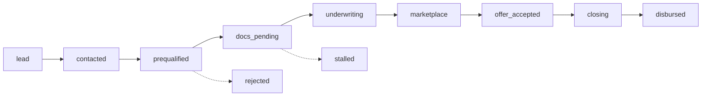

# HIPOTECALY — ARQUITECTURA CRM, TAREAS OPERATIVAS & TIMELINE (2026)

**Versión:** 1.0  
**Fecha:** Septiembre 2026  
**Fase:** Macrofase 6 (AI + Automation + CRM + Operational Intelligence)  
**Referencia de Código:** [`src/lib/crmService.ts`](src/lib/crmService.ts)  

---

## 1. INTRODUCCIÓN

El módulo **CRM & Tareas Operativas** de HIPOTECALY unifica la gestión comercial y la ejecución interna de los equipos que originan y gestionan préstamos con garantía hipotecaria (operadoras de crédito, cooperativas, escribanías y financieras).

Su diseño resuelve la brecha entre el lead inicial que simula en la web y la posterior formalización notarial y liquidación del crédito.

---

## 2. ETAPAS DEL PIPELINE COMERCIAL (PIPELINE STAGES)

1. **`lead`:** Solicitante que completó una simulación o consulta web inicial.
2. **`contacted`:** Primer contacto telefónico o mensaje cursado por el asesor.
3. **`prequalified`:** Filtro preliminar aprobado (zona, tipología y capacidad estimada).
4. **`docs_pending`:** Espera de digitalización de títulos, certificados o recibos de ingresos.
5. **`underwriting`:** Expediente en estudio legal, registral y de tasación con asistencia IA.
6. **`marketplace`:** Expediente anonimizado disponible para posturas de prestamistas en `/lender/opportunities`.
7. **`offer_accepted`:** Oferta de financiamiento aceptada por el solicitante en `/mi-cuenta`.
8. **`closing`:** Etapa de escrituración notarial, certificados definitivos y seguro de caución/vida.
9. **`disbursed`:** Crédito hipotecario liquidado y fondo transferido. Transición a Loan Servicing.
10. **`rejected` / `stalled`:** Rechazo fundado o expediente pausado por inactividad.

---

## 3. GESTIÓN DE TAREAS OPERATIVAS (OPERATIONAL BACKLOG)

Las tareas permiten coordinar a escribanos, peritos tasadores y analistas de crédito con trazabilidad:
- **Prioridad:** `low`, `medium`, `high`, `urgent`.
- **Estados:** `todo` ➔ `in_progress` ➔ `completed`.
- **Roles Destinatarios:** `analyst`, `underwriter`, `notary`, `admin`.
- **Asociación:** Vinculación directa con el identificador del caso (`caseId`) y cliente (`leadId`).

---

## 4. TIMELINE DE ACTIVIDAD (FORENSIC AUDIT TRAIL)

Cada intervención en el expediente —ya sea una acción de usuario o un trigger del motor de IA/automatización— se registra cronológicamente:
- **Actor:** `system`, `ai_agent`, `user`.
- **Acción:** `LEAD_REGISTERED`, `PIPELINE_STAGE_CHANGED`, `TASK_CREATED`, `TASK_STATUS_UPDATED`, `OFFER_SUBMITTED`, `DOCUMENT_VERIFIED`.
- **Marca Temporal:** ISO 8601 UTC.
