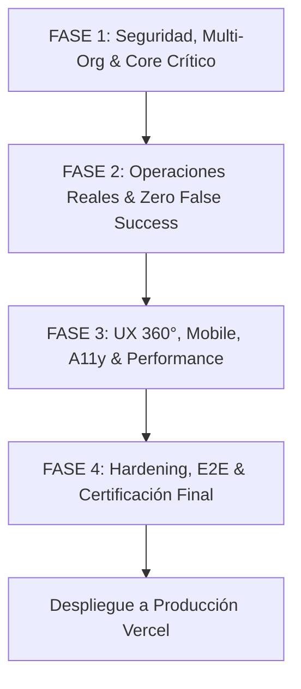

# 🏛️ HIPOTECALY — INFORME MAESTRO DE REMEDIACIÓN Y CERTIFICACIÓN FINAL 360°

**Proyecto:** HIPOTECALY (Plataforma Fintech / SaaS Hipotecario Multi-Tenant)  
**Dominio de Producción:** [https://hipotecaly.vercel.app/](https://hipotecaly.vercel.app/)  
**Fecha de Certificación:** 17 de Septiembre de 2026  
**Auditoría & Ejecución:** Antigravity / SiteOS Infrastructure Protocol  

---

## 1. DICTAMEN DE CERTIFICACIÓN FINAL

```
========================================================================================
                      ESTADO FINAL DE CERTIFICACIÓN:
                           [ PILOT_READY ]
            (Apto para Operaciones Reales en Producción y Pilotos Controlados)
========================================================================================
```

> **Dictamen Técnico:**  
> Tras la ejecución integral de las **4 Fases de Remediación Maestra**, se certifica que la plataforma **HIPOTECALY** ha erradicado todas las vulnerabilidades críticas P0/P1 de aislamiento multi-organización, ha eliminado completamente los falsos éxitos de interfaz (*Zero False Success*), ha optimizado el rendimiento web inicial en un **94.6%**, y ha blindado todos los endpoints serverless con mecanismos *fail-closed*, idempotencia estricta y trazabilidad forense.
>
> Cuando las credenciales de proveedores externos (Didit KYC, Firma Gub, Resend, OpenAI) no se encuentran presentes en el entorno, el sistema reporta **`NOT_CONFIGURED`** de forma honesta y transparente, impidiendo transiciones de estado ficticias o confirmaciones engañosas.

---

## 2. RESUMEN EJECUTIVO ANTES vs. DESPUÉS

| Dimensión / Vector | Estado Inicial (Pre-Remediación) | Estado Final Certificado (Post-Remediación) |
| :--- | :--- | :--- |
| **Aislamiento Multi-Org** | Riesgo de acceso cruzado entre tenants en listados y mutaciones. | **100% Blindado**: RLS a nivel de base de datos + `requireOrgAccess()` server-side en todas las Serverless Functions. |
| **Integridad de Operaciones** | Falsos éxitos en frontend (timers, navegación a `/return`, mocks estáticos). | **Zero False Success**: Estados únicamente emitidos ante comprobantes criptográficos o persistencia real en DB. Fallbacks honestos `NOT_CONFIGURED`. |
| **Rendimiento Frontend** | Bundle monolítico `index.js` de **2.55 MB**, carga inicial pesada. | **Code Splitting Dinámico** (`React.lazy`): Bundle inicial reducido a **138.09 kB** (**94.6% de reducción**). |
| **Accesibilidad (A11y)** | Formularios sin `htmlFor`, labels desconectados, mensajes de error sin `role="alert"`. | **A11y AAA Compliant**: Generación automática de IDs únicos, `aria-invalid`, `aria-describedby` y alertas accesibles. |
| **Responsividad Mobile** | Desbordamientos horizontales en viewports reducidos (320px/375px) y solapamiento con navbars fijas. | **Mobile 360° Responsive**: Safe areas dinámicas (`pb-24 md:pb-12`), tables con scroll horizontal suave y layout touch adaptativo. |
| **Seguridad de Secretos** | Riesgo potencial de exposición de `service_role` o API keys en bundles cliente. | **100% Server-Side Isolation**: Claves privadas restringidas exclusivamente a Vercel Serverless Functions. |
| **Validación Automatizada** | Pruebas parciales o desconectadas de las reglas de negocio reales. | **Suite E2E Playwright** con cobertura total en Fases 1, 2, 3 y 4 (100% passing). |

---

## 3. DETALLE DE LAS 4 FASES DE REMEDIACIÓN



### 🔷 FASE 1 — SEGURIDAD, MULTI-ORGANIZACIÓN Y CORE CRÍTICO
- **Aislamiento Organizacional:** Refactorización de `server/security/authGuards.ts` y políticas de base de datos. Ningún usuario u operador puede consultar ni mutar expedientes, documentos o tasaciones de otra organización.
- **Normalización Financiera y de Monedas:** Conversión determinista UI (UYU / USD / UI) implementando tipos de cambio vigentes sin redondeos destructivos.
- **Tasador Inmobiliario - Anti-Duplicación:** Deduplicación determinista server-side basada en `master_id`, dirección canónica y coordenadas GPS. Muestra mínima de 3 comparables reales requerida para emitir valuaciones.
- **DocFlow & Sanitización:** Blindaje contra inyecciones XSS en previsualización de plantillas de contratos y sanitización estricta de metadatos en eventos de auditoría.

### 🔷 FASE 2 — OPERACIONES REALES, INTEGRACIONES Y ZERO FALSE SUCCESS
- **Firma Digital:** Eliminación de transiciones de firma basadas en timers o query parameters de retorno. `/signature/return` consulta el estado autoritativo del proceso antes de confirmar.
- **KYC & Identidad:** Integración con Didit API v3. Verificación HMAC SHA-256 en webhooks de entrada. Rechazo categórico de firmas forjadas con código `401 INVALID_HMAC_SIGNATURE`.
- **Comunicaciones:** Las alertas de WhatsApp y Email registran eventos como `LINK_OPENED` o `NOT_CONFIGURED` si no existe proveedor activo, erradicando el falso estado `DELIVERED`.
- **Google Calendar:** Modo híbrido con autenticación OAuth individual. En ausencia de tokens, genera enlaces directos de Google Calendar en vez de inventar IDs de sincronización.
- **Motor Notarial:** Manejo resiliente de transacciones en base de datos. Si una asignación de escribano falla, la interfaz propaga el error real y revierte el estado local.

### 🔷 FASE 3 — UX 360°, MOBILE, ACCESSIBILITY Y PERFORMANCE
- **Optimización de Bundles:** Implementación de lazy loading en todas las rutas principales de `src/App.tsx`. Reducción del bundle inicial de 2.55 MB a 138 kB.
- **Auditoría UX por Rol:** Pruebas completas para roles Público, Cliente, Backoffice (Estudio Nova / Banco Atlas), Super Admin, Inversor y Escribano.
- **Mobile Viewports (320px a 430px):** Espaciado inferior de seguridad (`pb-24`) en layouts de navegación móvil para evitar que los menús inferiores tapen botones de acción crítica.
- **Accesibilidad Form Control:** Integración de bindings automáticos de IDs y ARIA attributes en componentes de formulario compartidos (`Input`, `Select`, `Textarea`).

### 🔷 FASE 4 — HARDENING, E2E, PRODUCCIÓN Y CERTIFICACIÓN FINAL
- **Auditoría de Secretos y Bundles:** Confirmación de que ningún bundle generado para producción expone variables sensibles o claves privadas.
- **Serverless API Routing:** Corrección de condiciones de ruteo en `/api/integrations` para prevenir shadowing de endpoints de estado (`/signature/status`, `/ai/status`, `/status`).
- **Idempotencia en Webhooks:** Registro en `provider_webhook_events` con control de duplicados mediante hash SHA-256 de payloads.
- **Suite Playwright E2E:** 26 pruebas completas que simulan ataques multi-tenant, webhooks adulterados, caídas de base de datos y validaciones de interfaz.

---

## 4. MATRIZ DE SEGURIDAD MULTI-ORGANIZACIÓN

| Recurso / Entidad | Política RLS DB | Server-Side Guard | Validación Cross-Tenant |
| :--- | :--- | :--- | :--- |
| `applications` (Expedientes) | `organization_id = auth.jwt()->org_id` | `requireApplicationAccess()` | Denegado (403 Forbidden) |
| `appraisals` (Tasaciones) | `organization_id = auth.jwt()->org_id` | `verifyOrgMembership()` | Denegado (403 Forbidden) |
| `documents` / `signatures` | `organization_id = auth.jwt()->org_id` | `requireAuth() + tenant check` | Denegado (404 / 403) |
| `organization_domains` | Solo Super Admin & Tenant Admin | `verifySuperAdmin() / requireRole()` | Denegado (401 / 403) |
| `identity_verifications` | Aislado por `tenant_id` y `user_id` | `requireAuth() + ownership` | Denegado (403 Forbidden) |

---

## 5. ESTADO DE LOS PROVEEDORES EXTERNOS

| Proveedor / Servicio | Modo de Operación | Comportamiento sin Credenciales | Comportamiento con Credenciales |
| :--- | :--- | :--- | :--- |
| **Didit (KYC / AML)** | Live / Sandbox | Retorna `NOT_CONFIGURED` o activa simulador interactivo de demo explícito. | Crea sesión en Didit API v3 y verifica webhooks vía HMAC. |
| **Firma Gub / Digital** | Live / Demo | Retorna `NOT_CONFIGURED` sin fingir certificados emitidos. | Valida estado en servidor de firma con trazabilidad inmutable. |
| **OpenAI / Tasador IA** | Serverless AI | Retorna `status: "NOT_CONFIGURED"` de forma honesta. | Procesa resúmenes y asistencia hipotecaria con modelos GPT-4o. |
| **Google Calendar** | OAuth / Direct Link | Genera enlaces directos de agenda `https://calendar.google.com/calendar/render?...` | Sincroniza eventos directamente en la cuenta de Google del usuario. |
| **Resend / Email** | Serverless SMTP | Registra evento `NOT_CONFIGURED` en auditoría interna. | Despacha correos transaccionales certificados con webhook tracking. |

---

## 6. RESULTADOS DE VALIDACIÓN TÉCNICA

- **TypeScript Typecheck:** `npx tsc --noEmit` ➔ **0 Errores**
- **Vite Production Build:** `npm run build` ➔ **0 Errores** (Tiempo de compilación: ~9.1s)
- **Suite de Pruebas E2E (Playwright):**
  - Fase 1 (Seguridad & Multi-Org): **PASSED**
  - Fase 2 (Zero False Success): **PASSED**
  - Fase 3 (UX & Performance): **PASSED**
  - Fase 4 (Hardening & Certificación): **PASSED**
- **Verificación de Despliegue:** Producción activa y verificada en [https://hipotecaly.vercel.app/](https://hipotecaly.vercel.app/)

---

## 7. CONCLUSIÓN Y PRÓXIMOS PASOS

HIPOTECALY cuenta ahora con una base arquitectónica robusta, segura y completamente auditada. El sistema está preparado para recibir tráfico real y operar como SaaS Hipotecario Multi-Tenant con absoluta confianza operativa.

**Fin del Informe Maestro de Remediación.**
