# HIPOTECALY — ARQUITECTURA DE INFORMACIÓN PÚBLICA DEFINITIVA
## MODELO DE DOBLE AUDIENCIA: PERSONAS (MARKETPLACE) & EMPRESAS (SAAS WHITE-LABEL)

**Documento Oficial de Arquitectura:** Macrofase 4A  
**Fecha:** 4 de Septiembre de 2026  
**Autor:** Antigravity (Google DeepMind - Advanced Agentic Coding)  
**Estado:** **APROBADO — BASELINE OFICIAL PARA MACROFASE 4B**

---

## 1. PRINCIPIO RECTOR: LA RESOLUCIÓN DE LA DUALIDAD

HIPOTECALY opera como un **Ecosistema Hipotecario Digital Bifronte**:
1. **Línea A — Para Personas / Propietarios (Marketplace Hipotecario):** Conecta a personas que poseen inmuebles con fuentes de financiamiento privado garantizado en Uruguay.
2. **Línea B — Para Empresas & Operadores (SaaS White-Label):** Provee la infraestructura de software, motor de matching, backoffice notarial y copiloto de IA para que prestamistas, financieras y estudios gestionen su propio negocio hipotecario bajo su propia marca.

> **Regla de Oro de la UX:** Ningún visitante debe confundir los dos productos. Un solicitante de préstamo nunca debe sentirse intimidado por tecnicismos B2B, y un directivo de una entidad financiera o prestamista nunca debe percibir a HIPOTECALY como un competidor que busca robarle clientes, sino como el **motor tecnológico** que potencia su operación.

---

## 2. MAPA GENERAL DE NAVEGACIÓN Y RUTAS PÚBLICAS

```mermaid
graph TD
    Root["/ (Home - Hub de Entrada Unificado)"] --> LineaA["LÍNEA PERSONAS (Marketplace)"]
    Root --> LineaB["LÍNEA EMPRESAS (SaaS Platform)"]

    %% Línea A
    LineaA --> A1["/simulador (Simulador de Capacidad LTV)"]
    LineaA --> A2["/solicitar (Wizard de Solicitud en 8 Pasos)"]
    LineaA --> A3["/como-funciona (Proceso y Respaldo Notarial)"]
    LineaA --> A4["/prestamos (Condiciones y Requisitos)"]
    LineaA --> A5["/preguntas-frecuentes (FAQs Prestatarios)"]
    LineaA --> A6["/mi-cuenta (Portal Privado del Solicitante)"]

    %% Línea B
    LineaB --> B1["/saas (Hub Central B2B)"]
    LineaB --> B2["/empresas/prestamistas (Prestamistas Privados & Inversores)"]
    LineaB --> B3["/empresas/financieras (Financieras & Originadores)"]
    LineaB --> B4["/empresas/estudios (Estudios Notariales & Jurídicos)"]
    LineaB --> B5["/saas/integracion (Modalidad A: Embeber en Web Actual)"]
    LineaB --> B6["/saas/plataforma-completa (Modalidad B: Llave en Mano)"]
    LineaB --> B7["/demo/nova/full (Showroom Interactivo White-Label)"]
    LineaB --> B8["/saas/precios (Modelos de Implementación)"]
    LineaB --> B9["/contacto?demo=true (Captura de Leads B2B)"]
```

---

## 3. HEADER DESKTOP: ARQUITECTURA DE NAVEGACIÓN DE ALTA CONVERSIÓN

El Header se estructura en dos niveles visuales:

### 3.1. Nivel Superior: Selector de Modo (Top Audience Bar)
- Franja oscura (`bg-slate-900`, 32px de alto):
  - **Lado Izquierdo:** Interruptor segmentado:
    - `Para Personas` (activo por defecto en `/`, `/simulador`, `/como-funciona`).
    - `Para Empresas & Inversores` (activo en `/saas`, `/empresas/*`, `/demo/*`).
  - **Lado Derecho:**
    - `✨ Ver Demo NOVA` $\rightarrow$ Enlace directo al showroom de marca blanca.
    - `Agendar Demo B2B` $\rightarrow$ CTA directo a `/contacto?demo=true`.

### 3.2. Nivel Principal: Navegación Adaptativa según Contexto
1. **Cuando el usuario navega en Modo Personas:**
   - **Logo:** Monograma HIPOTECALY + *"Financiación con garantía hipotecaria"*.
   - **Links:**
     - `Cómo funciona` (`/como-funciona`)
     - `Préstamos` (`/prestamos`)
     - `Simulador` (`/simulador`)
     - `Plataforma SaaS` (`/saas`, con badge `B2B`)
     - `Preguntas frecuentes` (`/preguntas-frecuentes`)
   - **Acciones:**
     - Botón Secundario: `Solicitar Demo` (`/contacto?demo=true`)
     - Botón Primario: `Solicitar préstamo` (`/solicitar`)
     - Enlace de Acceso: `Ingresar` (`/ingresar`)

2. **Cuando el usuario navega en Modo Empresas (`SaaSNavbar`):**
   - **Logo:** Monograma HIPOTECALY + *"SaaS & White-Label Hipotecario"*.
   - **Links:**
     - `Plataforma` (`/saas`)
     - **Dropdown "Soluciones":**
       - `Para Prestamistas` (`/empresas/prestamistas` - Oportunidades & Anti-Bypass)
       - `Para Financieras` (`/empresas/financieras` - Originación & Scoring)
       - `Para Estudios` (`/empresas/estudios` - Títulos, Tasaciones & Legajos)
     - **Dropdown "Modalidades":**
       - `Integración a Web Existente` (`/saas/integracion`)
       - `Plataforma Completa Llave en Mano` (`/saas/plataforma-completa`)
     - `White-Label` (`/saas/plataforma-completa#white-label`)
     - `Showroom NOVA` (`/demo/nova/full`)
     - `Planes` (`/saas/precios`)
   - **Acciones:**
     - Botón Secundario: `Acceso Backoffice` (`/app`)
     - Botón Primario: `AGENDAR DEMO` (`/contacto?demo=true`)

---

## 4. EXPERIENCIA MOBILE (VIEWPORT 390×844)

En pantallas reducidas, se erradica la subordinación del SaaS:

1. **Header Mobile Compacto:**
   - Logo + Selector rápido de modo (`Personas | Empresas`).
   - Botón contextual (`Solicitar` o `Demo`).
   - Botón de Menú Hamburguesa.

2. **Drawer Mobile Dividido en Bloques Claros:**
   - **Bloque Superior Destacado:** Tarjeta con fondo oscuro y acentos verdes:
     - Título: *HIPOTECALY para Empresas & Inversores*.
     - Subtítulo: *Software hipotecario llave en mano bajo tu propia marca*.
     - Acciones rápidas: `Conocer SaaS` (`/saas`) y `Ver Demo NOVA` (`/demo/nova/full`).
   - **Bloque Medio:** Enlaces de navegación estructurados por pestañas o acordión (*Personas* / *Empresas*).
   - **Bloque Inferior de Conversión:**
     - `Solicitar préstamo` (Botón primario verde grande).
     - `Solicitar Demo B2B` (Botón secundario azul oscuro con icono de empresa).
     - `Ingresar a Mi Cuenta / Backoffice` (Botón ghost).

---

## 5. LA NUEVA HOME DE ENTRADA AL ECOSISTEMA

La Home deja de ser una landing exclusiva de préstamos para transformarse en el **portal de entrada al ecosistema hipotecario**:

### 5.1. Hero Categórico Unificado
- **H1:** *"La infraestructura digital para el crédito con garantía hipotecaria en Uruguay."*
- **Subtítulo:** *"Conectamos propietarios con capital privado respaldado por inmuebles, y proveemos la tecnología para operar carteras de crédito bajo tu propia marca."*
- **Selector de Intención Dual (Grandes Cards Interactivas):**
  - **Card 1 (Propietarios):** *"Necesito financiación sobre mi inmueble"* $\rightarrow$ Monto hasta el 40% del valor, tasa fija, plazos hasta 5 años. CTA: `Simular mi préstamo →`.
  - **Card 2 (Empresas & Prestamistas):** *"Quiero digitalizar mi negocio de crédito"* $\rightarrow$ White-label, matching, onboarding en 30s y portal de inversores. CTA: `Conocer HIPOTECALY SaaS →`.

### 5.2. Sección 2: El Marketplace Transparente (Para Personas)
- Beneficios de LTV, plazos, privacidad y respaldo notarial.
- Proceso de 4 pasos (Simulá $\rightarrow$ Analizamos $\rightarrow$ Propuesta $\rightarrow$ Formalización).

### 5.3. Sección 3: La Plataforma Tecnológica (Para Empresas & Profesionales)
- Demostración visual de las 3 modalidades:
  - **Modalidad A:** Widget / API para web existente.
  - **Modalidad B:** Ecosistema completo llave en mano.
  - **Modalidad C:** Full White-Label institucional con dominio propio.
- Segmentación por operador: Prestamistas, Financieras, Estudios y Brokers.
- Showcase interactivo con link directo al Showroom NOVA.

---

## 6. PÁGINAS DE SOLUCIÓN VERTICALES POR ROL

### 6.1. `/empresas/prestamistas` (Prestamistas Privados & Family Offices)
- **Propuesta:** Originación segura de operaciones hipotecarias sin riesgo de desintermediación.
- **Features Destacadas:**
  - Feed de oportunidades anonimizadas en tiempo real.
  - Protocolo Anti-Bypass (padrón, calle y teléfono ocultos hasta formalización notarial).
  - Simulador de cotización financiera (Amortización Francesa vs Interés Puro).
  - Trazabilidad y formalización con escribano público.
- **CTA:** `Solicitar Acceso como Prestamista` $\rightarrow$ `/contacto?demo=true&rol=prestamista`.

### 6.2. `/empresas/financieras` (Empresas de Crédito & Originadores)
- **Propuesta:** Digitalización integral del intake de solicitudes, legajo digital y scoring crediticio.
- **Features Destacadas:**
  - Asistente de solicitud de 8 pasos personalizable con los límites de la financiera.
  - Portal de clientes para autogestión de documentación y fotos.
  - Panel operativo de backoffice para analistas con asignación de roles.
  - Políticas de crédito dinámicas (LTV, montos mínimos/máximos, plazos).
- **CTA:** `Agendar Demostración para Financieras` $\rightarrow$ `/contacto?demo=true&rol=financiera`.

### 6.3. `/empresas/estudios` (Estudios Notariales & Jurídicos)
- **Propuesta:** Gestión estructurada del expediente notarial, checklist de títulos y valuaciones.
- **Features Destacadas:**
  - Repositorio documental cifrado con aislamiento estricto de expedientes.
  - Trazabilidad inmutable de observaciones sobre títulos y padrones.
  - Coordinación de formalización e inscripciones registrales.
  - Módulo de transparencia de costos de cierre (aranceles, montepío, certificados).
- **CTA:** `Solicitar Presentación para Estudios` $\rightarrow$ `/contacto?demo=true&rol=estudio`.

---

## 7. EL PRODUCT SHOWROOM DE NOVA

La demo NOVA se convierte en el buque insignia de ventas:
- **Ruta Pública:** `/demo` o `/demo/nova/full`.
- **Experiencia de Usuario:**
  - Banner explicativo: *"Estás explorando una financiera real ficticia (NOVA Crédito Hipotecario) operando 100% sobre la tecnología White-Label de HIPOTECALY."*
  - Capacidad de interactuar con el simulador, avanzar en la solicitud y visualizar cómo se ve la marca propia.
  - Enlace flotante: *"¿Querés una plataforma igual para tu empresa? Agendar Demo con tu marca"*.

---

## 8. ESPECIFICACIÓN DE ANALYTICS B2B

Eventos desacoplados del funnel de prestatarios para métricas comerciales limpias:
- `b2b_home_view`: Visita a sección B2B o `/saas`.
- `b2b_solution_click`: Click en Prestamistas, Financieras o Estudios.
- `b2b_showroom_enter`: Ingreso al Showroom NOVA.
- `b2b_demo_request_start`: Apertura del formulario de solicitud de demo.
- `b2b_demo_request_submit`: Envío exitoso de lead calificado con tipo de organización.
- `b2b_whitelabel_explore`: Exploración de características de marca blanca.
