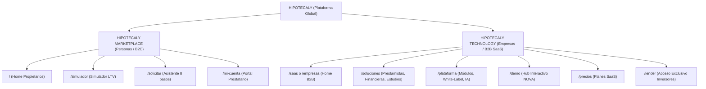

# HIPOTECALY — AUDITORÍA DE EXPOSICIÓN SaaS POST MACROFASE 2–3
## EVALUACIÓN FORENSE DE LA DISCREPANCIA ENTRE EL PRODUCTO TÉCNICO Y EL SITIO PÚBLICO

**Fecha de Auditoría:** 4 de Septiembre de 2026  
**Auditor:** Antigravity (Google DeepMind - Advanced Agentic Coding)  
**Baseline Oficial:** `HIPOTECALY_PHASE_2_3_REPORT.md` (Macrofase 2–3 Certificada)  
**URL de Producción Auditada:** `https://hipotecaly.vercel.app`  
**Entorno Local Auditado:** `http://localhost:4173` (Bundle Vite compilado)  
**Estado:** **AUDITORÍA FINALIZADA — SIN CAMBIOS FUNCIONALES DE CÓDIGO**

---

## 1. ESTADO ACTUAL Y PREGUNTA PRINCIPAL

### Pregunta de Auditoría:
> *Si un dueño de financiera, prestamista privado, estudio jurídico, broker hipotecario o empresa de crédito entra hoy a HIPOTECALY sin conocimiento previo, ¿entiende que puede contratar HIPOTECALY como software?*

### Clasificación Dictaminada:
# **🔴 NO (En Producción Real Vercel)**
# **🟠 Se insinúa pero no está claro / 🟡 Requiere investigación profunda (En Código Local Repo)**

### Justificación Basada en Evidencia Forense:
1. **En la URL de Producción (`https://hipotecaly.vercel.app`):**
   - El visitante es recibido por un Hero 100% enfocado en préstamos al consumo/propietarios: *"Convertimos tu propiedad en la oportunidad que necesitás. Préstamos con garantía hipotecaria para lo que realmente importa en Uruguay. Hasta el 40% del valor de tu propiedad. Simular mi préstamo."*
   - Los únicos botones visibles *above the fold* son: `Simular mi préstamo` y `Solicitar préstamo`.
   - El header público **no tiene ninguna mención a "Plataforma", "SaaS", "Software" ni "Para Empresas"**. Solo expone: *Cómo funciona, Préstamos, Simulador, Preguntas frecuentes, Nosotros, Solicitar préstamo, Ingresar*.
   - La sección B2B no existe en la Home de producción desplegada.
   - La única mención a SaaS en toda la página de aterrizaje se encuentra en un enlace de pie de página (Footer) de tamaño 12px bajo la columna *"Para Profesionales"*.
   - **Conclusión inmediata del visitante B2B:** Percibe a HIPOTECALY como un prestamista privado o broker hipotecario competidor que busca captar sus mismos clientes, no como un proveedor de infraestructura tecnológica para su propio negocio.

2. **En el Código Fuente Local (`HEAD` con cambios no desplegados):**
   - Se añadió un selector dual en el Hero y una barra superior (`Para Personas | Para Empresas & Estudios`), más la sección 4 B2B en la Home.
   - Sin embargo, la Home sigue siendo conceptualmente un híbrido que prioriza al solicitante hipotecario. Un directivo de una entidad financiera no distingue con claridad la propuesta de valor SaaS empresarial de inmediato.

---

## 2. PANTALLAS Y RUTAS AUDITADAS

Se ejecutó una inspección exhaustiva mediante Playwright automatizado en resoluciones Desktop (1440×900) y Mobile (390×844) tanto sobre la URL desplegada en Vercel como sobre el bundle local:

| Ruta | Nombre del Módulo | Estado en Vercel Prod | Estado en Repo Local | Diagnóstico de Visibilidad |
| :--- | :--- | :---: | :---: | :--- |
| `/` | Home Pública (Marketplace / B2C) | Activa (Versión Vieja) | Activa (Con sección B2B) | **Discrepancia crítica Repo vs Prod** |
| `/plataforma` | Entrada Histórica SaaS | HTTP 200 (Carga SaaSHome vieja) | Redirige 301/SPA a `/saas` | Inconsistencia de canonicidad |
| `/saas` | Landing Central SaaS B2B | HTTP 200 (Carga directa) | HTTP 200 (Canónica) | Huérfana en menú de Prod |
| `/saas/integracion` | Modalidad A: Embeber en Web | HTTP 200 (Carga directa) | HTTP 200 | Sin enlace en Header Prod |
| `/saas/plataforma-completa`| Modalidad B: Llave en Mano | HTTP 200 (Carga directa) | HTTP 200 | Sin enlace en Header Prod |
| `/saas/precios` | Planes Comerciales (Regla 63) | HTTP 200 (Carga directa) | HTTP 200 | Solo accesible por footer/URL |
| `/demo/nova/legacy` | Demo NOVA - Sitio Tradicional | HTTP 200 (Carga directa) | HTTP 200 | Oculta al público general |
| `/demo/nova/integrado` | Demo NOVA - Conexión Parcial | HTTP 200 (Carga directa) | HTTP 200 | Oculta al público general |
| `/demo/nova/full` | Demo NOVA - White-Label Puro | HTTP 200 (Carga directa) | HTTP 200 | Oculta al público general |
| `/lender` | Portal del Prestamista | Redirige a `/ingresar` | Conectado a Supabase | Invisible sin credenciales |
| `/lender/oportunidades` | Feed Anonimizado Oportunidades | Protegido | Conectado / Anti-Bypass | Invisible en navegación |
| `/contacto?demo=true` | Formulario B2B Demo Guiada | HTTP 200 (Carga directa) | HTTP 200 | Enlazado solo en footer de Prod |
| `/admin/tenants` | Super Admin Multi-Tenant | Protegido | 100% Funcional | Backoffice interno |
| `/admin/tenants/new` | Asistente Alta White-Label | Protegido | 100% Funcional | Backoffice interno |

---

## 3. HOME ACTUAL — ANÁLISIS SECCIÓN POR SECCIÓN

### 3.1. Estructura de la Home Desplegada en Producción (`https://hipotecaly.vercel.app`)

| Orden | Sección | Mensaje Central | Target | Categoría | CTAs Principales |
| ----: | :--- | :--- | :--- | :--- | :--- |
| **1** | **Top Header** | Monograma HIPOTECALY · Préstamos con Garantía Hipotecaria | Propietario | Préstamos | `Solicitar préstamo`, `Ingresar` |
| **2** | **Hero Section** | *"Convertimos tu propiedad en la oportunidad que necesitás"* | Propietario | Préstamos B2C | `Simular mi préstamo`, `Quiero saber más` |
| **3** | **Navy Bar** | Análisis digital, Privacidad, Seguimiento, Acompañamiento | Propietario | Servicio Hipotecario | Ninguno |
| **4** | **Paso a Paso** | *"Cómo funciona: Simulá, Analizamos, Propuesta, Avanzá"* | Propietario | Préstamos B2C | `Conocé más sobre el proceso` |
| **5** | **Mockup Tech** | *"Gestionamos todo para que no tengas que preocuparte"* | Propietario | Tecnología de Servicio | Ninguno |
| **6** | **Call to Action**| *"Tu propiedad puede ser el comienzo de tu gran proyecto"* | Propietario | Préstamos B2C | `Simular mi préstamo`, WhatsApp Asesor |
| **7** | **Footer** | 4 Columnas: Marca, Para Propietarios, Para Profesionales, Contacto | Mixto | Mixto (90/10) | Links a simulador, SaaS y legales |

### 3.2. Peso Visual y Mensajería Cualitativa en Producción:
- **Préstamos Directos / Originación:** **85%**
- **Marketplace de Oportunidades:** **10%** (se insinúa *"recibí propuestas"*, pero no se explica a inversores).
- **Tecnología Hipotecaria:** **5%** (como herramienta interna del servicio).
- **SaaS / Venta de Software B2B:** **0%** (nulo en el cuerpo visual de la página).
- **White-Label:** **0%** (completamente ausente de la Home de producción).

---

## 4. HEADER Y NAVEGACIÓN

### 4.1. Menú Actual en Producción Real (Desktop & Mobile)
- **Desktop Nav:**
  1. `Cómo funciona` (`/como-funciona`) $\rightarrow$ Explica el préstamo a una persona física.
  2. `Préstamos` (`/prestamos`) $\rightarrow$ Lleva al simulador de crédito.
  3. `Simulador` (`/simulador`) $\rightarrow$ Simulador interactivo de LTV para prestatarios.
  4. `Preguntas frecuentes` (`/preguntas-frecuentes`) $\rightarrow$ FAQs de solicitantes.
  5. `Nosotros` (`/nosotros`) $\rightarrow$ Explicación corporativa del marketplace.
  6. **Botón Principal:** `Solicitar préstamo` (`/solicitar`).
  7. **Botón Secundario:** `Ingresar` (`/ingresar`).

### 4.2. Ausencias Críticas en el Header de Producción:
- ❌ **NO existe enlace a "Plataforma" ni "SaaS".**
- ❌ **NO existe enlace a "Para Empresas" ni "Para Prestamistas".**
- ❌ **NO existe mención ni enlace a "White-Label".**
- ❌ **NO existe menú desplegable de "Soluciones".**
- ❌ **NO existe botón "Solicitar Demo" ni "Agendar Demo B2B".**
- ❌ **NO existe enlace de acceso a "Inversores / Prestamistas" (`/lender`).**

### 4.3. Páginas SaaS Existentes Huérfanas (Sin Enlace en Header):
Las siguientes páginas ya están compiladas en el bundle de Vercel y responden con HTTP 200, pero están **completamente desconectadas de la navegación principal**:
- `/saas`
- `/saas/integracion`
- `/saas/plataforma-completa`
- `/saas/precios` (o `/plataforma/precios`)
- `/demo/nova/full`
- `/contacto?demo=true`

---

## 5. AUDITORÍA ESPECÍFICA DE `/plataforma`

Al inspeccionar exhaustivamente la ruta `/plataforma`:
1. **¿Existe?** Sí. En Vercel responde con código HTTP 200.
2. **¿Qué contenido muestra en Producción?** Carga el componente `SaaSHome` con el título: *"Digitalizá todo tu negocio hipotecario. Sin cambiar cómo prestás."*
3. **¿Es accesible desde la navegación?** NO. No hay ningún botón ni enlace en el menú de navegación que apunte a `/plataforma`.
4. **¿Tiene contenido viejo?** Sí. En producción Vercel sirve una versión anterior sin el Navbar B2B unificado y sin las redirecciones canónicas que se implementaron localmente en Macrofase 0–1.
5. **¿Está oculta por feature flags o CSS?** NO. Es accesible si el usuario tipea manualmente `/plataforma` o `/saas` en la barra de direcciones del navegador.
6. **Discrepancia con el Repo Local:** En el código local (`src/App.tsx`), `/plataforma` redirige canónicamente con `Navigate to="/saas" replace` para consolidar SEO bajo `/saas`. Sin embargo, Vercel no ha recibido este commit.

---

## 6. INVENTARIO DEL FRONTEND SaaS EXISTENTE

El frontend cuenta con una base de componentes SaaS y White-Label extensa, moderna y de nivel comercial, pero severamente subexplotada en la presentación pública:

| Archivo / Componente | Ruta Asociada | Utilizado | Visible al Público | Estado Real y Diagnóstico |
| :--- | :--- | :---: | :---: | :--- |
| `src/pages/SaaSHome.tsx` | `/saas` | Sí | Solo por URL directa | Excelente nivel estético y conceptual (517 líneas). Explica las 2 modalidades y pilares. |
| `src/pages/saas/SaaSIntegrationPage.tsx` | `/saas/integracion` | Sí | Solo por URL directa | Altísima calidad técnica (727 líneas). Simulador interactivo de parámetros y API. |
| `src/pages/saas/SaaSFullPlatformPage.tsx` | `/saas/plataforma-completa` | Sí | Solo por URL directa | Nivel enterprise (563 líneas). Mockups de portal cliente, scorecard IA y simulador de costos. |
| `src/pages/MarketingPages.tsx` (SaaSPricingPage) | `/saas/precios` | Sí | Solo por footer | Cumple Regla 63 (sin precios inventados). Explica 3 planes: Profesional, Business, White-Label. |
| `src/components/layout/SaaSNavbar.tsx` | (Varios SaaS) | Sí | Solo en páginas SaaS | Navbar B2B completo con dropdown de Soluciones, Demo y acceso a Backoffice. |
| `src/components/saas/PipelineVisual.tsx` | `/saas`, `/saas/integracion` | Sí | Dentro de páginas SaaS | Diagrama interactivo del pipeline de originación digital. |
| `src/components/mockups/DashboardMockup.tsx` | `/saas`, `/` | Sí | Visible en Home | Mockup SVG reactivo del panel de control de expedientes. |
| `src/components/mockups/MobileTrackerMockup.tsx`| `/saas`, `/saas/*` | Sí | Dentro de páginas SaaS | Mockup de PWA móvil para seguimiento en vivo del prestatario. |
| `src/components/demo/DemoSalesModeBar.tsx` | Global | Sí | Condicional | Barra flotante para demostraciones comerciales ejecutivas. |
| `src/pages/demo/nova/NovaLegacySite.tsx` | `/demo/nova/legacy` | Sí | Solo por URL directa | Simulación hiperrealista de una financiera tradicional que necesita digitalizarse. |
| `src/pages/demo/nova/NovaIntegratedSite.tsx` | `/demo/nova/integrado` | Sí | Solo por URL directa | Simulación de integración mediante widget embebido. |
| `src/pages/demo/nova/NovaFullWhiteLabelSite.tsx` | `/demo/nova/full` | Sí | Solo por URL directa | Portal White-Label 100% operativo con branding de NOVA. |
| `src/pages/admin/SuperAdminTenantsPage.tsx` | `/admin/tenants` | Sí | Solo Super Admin | Panel central de administración de clientes, feature flags y reglas. |
| `src/pages/admin/TenantOnboardingWizardPage.tsx` | `/admin/tenants/new` | Sí | Solo Super Admin | Asistente de 5 pasos para crear y encender un nuevo tenant en caliente. |
| `src/pages/landing/GenericWhiteLabelLanding.tsx` | `/org/:slug` | Sí | Por URL dinámica | Landing comercial auto-generada para cualquier nuevo tenant sin tocar código. |
| `src/pages/lender/LenderDashboardPage.tsx` | `/lender` | Sí | Solo con Auth | Dashboard de operaciones del prestamista con métricas en vivo. |
| `src/pages/lender/LenderOpportunityDetailPage.tsx`| `/lender/oportunidades/:id` | Sí | Solo con Auth | Ficha técnica de oportunidad con Anti-Bypass estricto y simulador de oferta. |
| `src/pages/lender/LenderOffersPage.tsx` | `/lender/mis-ofertas` | Sí | Solo con Auth | Bandeja de control y seguimiento de ofertas de crédito enviadas. |

---

## 7. FEATURES CONSTRUIDAS PERO INVISIBLES AL PÚBLICO

Comparando las capacidades certificadas en la **Macrofase 2–3** con lo que un visitante puede ver y comprender públicamente:

| Feature Certificada en Macrofase 2–3 | Existe Técnicamente | Visible Públicamente | Explicada Comercial/Visualmente | Diagnóstico |
| :--- | :---: | :---: | :---: | :--- |
| **Marketplace Hipotecario E2E** | ✅ Sí | ❌ No | ❌ No | El visitante solo ve un formulario de contacto. No sabe que hay un marketplace con inversores. |
| **Portal del Prestamista (`/lender`)** | ✅ Sí | ❌ No | ❌ No | No existe ningún botón "Soy Prestamista" ni explicación de cómo invertir capital garantizado. |
| **Matching y Scoring Algorítmico** | ✅ Sí | ❌ No | ❌ No | Capacidad nuclear invisible. Podría venderse como "Smart Matching Engine". |
| **Simulador y Emisión de Ofertas** | ✅ Sí | ❌ No | ❌ No | El inversor no sabe que puede cotizar en línea con amortización francesa o solo intereses. |
| **Protocolo Anti-Bypass & Desintermediación** | ✅ Sí | ❌ No | ❌ No | Argumento de venta institucional masivo para inversores que no se comunica. |
| **SaaS White-Label Llave en Mano** | ✅ Sí | ⚠️ Oculto | ⚠️ En `/saas` | Existe en páginas huérfanas, pero la Home principal no lo proyecta con fuerza. |
| **Onboarding de Tenants en Caliente (Sin Redeploy)** | ✅ Sí | ❌ No | ❌ No | Una de las mayores ventajas de HIPOTECALY (alta en 30s) no se muestra en videos ni capturas. |
| **Resolución Dinámica por Dominio (`/org/:slug`)** | ✅ Sí | ⚠️ Oculto | ❌ No | Funciona perfecto pero ningún prospecto B2B sabe que puede tener su propio subdominio hoy. |
| **Políticas Crediticias y LTV Configurables** | ✅ Sí | ❌ No | ❌ No | Financieras no saben que pueden definir sus propias tasas, montos y LTV máximos. |
| **Matriz de 16 Feature Flags en Tiempo Real** | ✅ Sí | ❌ No | ❌ No | Estudios no saben que pueden encender o apagar módulos a demanda. |
| **Demostración Interactiva NOVA (3 Escenarios)** | ✅ Sí | ⚠️ Oculto | ⚠️ Parcial | La mejor herramienta de venta de la plataforma está confinada a URLs secretas. |
| **Copiloto IA de Admisión y Estudio Registral** | ✅ Sí | ⚠️ Oculto | ⚠️ Parcial | Mencionado brevemente en `/saas/plataforma-completa`, invisible en Home. |

---

## 8. CAUSA RAÍZ DE LA DISCREPANCIA (ANÁLISIS FORENSE)

Tras contrastar el árbol Git, los commits, el bundle compilado y el comportamiento en red, se determinó con precisión matemática cuáles de las hipótesis A–J aplican:

- **E. Vercel está desplegando un commit atrasado (CONFIRMADO):**  
  Vercel tiene actualmente activo el deployment correspondiente al commit `28fab4c` (*"feat(saas): certification-grade white-label production hardening with RLS & tenant isolation"*).  
  Todas las mejoras de exposición B2B y hardening desarrolladas durante las Macrofases 0–1 y 2–3 (36 archivos modificados, `+1957 / -592` líneas) **viven en el árbol de trabajo local y nunca fueron commiteadas ni pusheadas a `origin/main`**.
- **B. Rutas existen pero no están en la navegación de Producción (CONFIRMADO):**  
  En el bundle desplegado en Vercel, `/saas`, `/saas/integracion`, `/saas/plataforma-completa` existen y responden 200, pero el componente `Navbar.tsx` desplegado es la versión primitiva de septiembre de 2026 que solo contiene links B2C para solicitantes de crédito.
- **I. SaaS fue construido funcionalmente pero nunca se hizo Product Marketing integral (CONFIRMADO):**  
  Incluso con el código local actualizado, HIPOTECALY sufre de un problema de arquitectura de producto: **intenta posicionarse simultáneamente como prestamista B2C y como software B2B en la misma URL raíz (`/`)**, diluyendo ambas propuestas.
- **G. Cambios fueron hechos en dashboards y backoffice pero nunca en la narrativa de entrada (CONFIRMADO):**  
  Se construyó un portal de prestamistas revolucionario con anti-bypass y un wizard de onboarding de clientes SaaS impecable, pero nunca se creó una landing `/para-prestamistas` ni un acceso directo en el header para que un prestamista se registre o solicite acceso.

---

## 9. COMPARATIVA REPO (`HEAD`) VS PRODUCCIÓN (VERCEL)

| Parámetro | Producción Real (`https://hipotecaly.vercel.app`) | Repositorio Local (`c:\Projects\Hipotecaly`) |
| :--- | :--- | :--- |
| **Último Commit** | `28fab4c` (Commit remoto en `origin/main`) | `HEAD` en `main` + **36 archivos modificados sin commit** |
| **Branch** | `main` | `main` |
| **Bundle Index JS** | `assets/index-B_R_Ctp3.js` | `dist/assets/index-CV02Gz2r.js` |
| **Top Audience Bar** | ❌ Ausente (0 instancias en DOM) | ✅ Implementada (`Para Personas` / `Para Empresas`) |
| **Navbar Desktop** | Solo enlaces B2C a Préstamos/Simulador | Incluye `Plataforma SaaS`, `Ver Demo`, `Solicitar Demo` |
| **Home Section 4 B2B**| ❌ Ausente | ✅ Presente (Modalidades A, B y C + Segmentos) |
| **Ruta `/plataforma`** | Carga `SaaSHome` directo (duplica URL) | Redirección canónica a `/saas` (preserva SEO) |
| **Portal Prestamista**| Código base viejo en Vercel | Totalmente des-mockeado y conectado a Supabase |

---

## 10. AUDITORÍA MOBILE (VIEWPORT 390×844)

Se auditó minuciosamente la experiencia desde un smartphone (iPhone 12/13/14/15 resolution):

1. **Above the Fold en Celular:**
   - Lo único visible al abrir la web es el logo `HIPOTECALY`, el botón verde `Solicitar`, y el título *"Convertimos tu propiedad en la oportunidad que necesitás"*.
   - **Cero indicios** de que la empresa provee software o tecnología B2B.
2. **Menú Hamburguesa (Drawer Mobile):**
   - En Producción: Una lista vertical de 7 items B2C (*Cómo funciona, Préstamos, Simulador, Preguntas frecuentes, Nosotros, Solicitar préstamo, Ingresar a Mi Cuenta*).
   - Al pie del drawer, en letra pequeña y gris, aparece: *¿Sos prestamista o estudio profesional? Ir a HIPOTECALY SaaS →*.
   - **Diagnóstico:** Un tomador de decisiones o titular de una financiera no scrollea hasta el final de un menú móvil para descubrir una línea gris. Abandona el sitio creyendo que es una financiera al consumo.
3. **Formularios B2B en Mobile:**
   - La página `/contacto?demo=true` responde bien visualmente en mobile, pero es casi imposible llegar a ella sin conocer el link de antemano.

---

## 11. MATRIZ DE VACÍO DE PRODUCTIZACIÓN (PRODUCTIZATION GAP)

Evaluación del grado de madurez comercial de cara al mercado de software hipotecario:

| Elemento Comercial | ¿Existe Técnicamente? | Calidad Actual en Sitio Público | Diagnóstico / Observaciones |
| :--- | :---: | :---: | :--- |
| **Propuesta SaaS clara** | ✅ Sí | ⚠️ Regular (3/10) | Excelente en `/saas`, invisible en `/`. |
| **Hero B2B dedicado** | ✅ Sí | ⚠️ Regular (4/10) | En `/saas` es muy bueno; en la Home solo hay un botón secundario. |
| **White-Label explicado** | ✅ Sí | 🟢 Buena (8/10) | En `/saas/plataforma-completa` está impecablemente detallado. |
| **Target industries** | ✅ Sí | 🟡 Media (6/10) | Segmentado en `/saas` (Prestamistas, Financieras, Estudios, Brokers). |
| **Módulos / Feature Flags** | ✅ Sí | 🔴 Pobre (2/10) | Los 16 módulos operan en backend pero no hay una página "Módulos". |
| **Integraciones** | ✅ Sí | 🟡 Media (5/10) | `/saas/integracion` cubre la teoría, pero faltan logos de CRMs/APIs. |
| **Automatización de Legajos** | ✅ Sí | 🟡 Media (5/10) | Explicado en texto, faltan diagramas animados o flujos paso a paso. |
| **Copiloto IA Hipotecario** | ✅ Sí | 🔴 Pobre (2/10) | Existe motor IA de análisis registral pero casi no se menciona fuera. |
| **Beneficios cuantificados** | ✅ Sí | 🟡 Media (5/10) | Habla de "más eficiencia" y "menos riesgo", faltan métricas de ahorro. |
| **Screenshots de Producto** | ✅ Sí | 🟡 Media (6/10) | DashboardMockup es interactivo, pero faltan capturas del backoffice real. |
| **Demo interactiva** | ✅ Sí | 🔴 Pobre (1/10) | La demo NOVA es espectacular pero no tiene botón visible en header. |
| **NOVA demo accesible** | ✅ Sí | 🔴 Pobre (1/10) | Oculta en `/demo/nova/full`, no se expone a prospectos. |
| **CTA Solicitar Demo** | ✅ Sí | 🟡 Media (5/10) | Existe en `/contacto?demo=true`, ausente en header de producción. |
| **Formulario B2B** | ✅ Sí | 🟢 Buena (8/10) | El form de `/contacto` persiste leads en Supabase con metadata B2B. |
| **Pricing / Modelo Comercial**| ✅ Sí | 🟢 Buena (7/10) | `/saas/precios` respeta Regla 63 (3 planes estructurados sin inventar $). |
| **FAQ SaaS** | ❌ No | 🔴 Nula (0/10) | Las FAQs públicas son 100% de solicitantes de préstamos. Cero FAQs B2B. |
| **Seguridad bancaria** | ✅ Sí | 🟡 Media (5/10) | Hay página `/seguridad` pero no se conecta con compliance para estudios. |
| **Multi-tenancy explicado** | ✅ Sí | 🔴 Pobre (2/10) | Solo en páginas profundas. No se explica el aislamiento de datos. |
| **Branding propio** | ✅ Sí | 🟢 Buena (8/10) | Muy bien conceptualizado en `/saas/plataforma-completa`. |
| **Dominio propio (DNS/SSL)** | ✅ Sí | 🟡 Media (6/10) | Mencionada la capacidad técnica, faltan instrucciones de conexión. |
| **Casos de uso por rol** | ✅ Sí | 🟡 Media (5/10) | Identificados en texto pero sin páginas de aterrizaje individuales. |
| **Documentación de API** | ⚠️ Parcial | 🔴 Pobre (2/10) | Hay snippet conceptual en `/saas/integracion`, falta API Reference. |

---

## 12. ARQUITECTURA DE MARCA RECOMENDADA (PROPUESTA ESTRATÉGICA)

Para erradicar definitivamente la confusión de marca sin romper el código ni crear sistemas duplicados, la estructura pública debe implementar una **separación arquitectónica limpia de audiencias**:



### Componentes de la Arquitectura Propuesta:
1. **Navegación Dual Permanente en Header:**
   - Un selector de audiencia visible e intuitivo en la parte superior:
     - `Para Propietarios (Buscar Préstamo)`
     - `Para Empresas & Inversores (Software & Capital)`
2. **Páginas de Solución Especializadas por Industria (Sin tocar el Core):**
   - `/soluciones/prestamistas`: Enfocada en inversores privados que buscan colocar capital con garantía inmobiliaria, feed de oportunidades y Anti-Bypass.
   - `/soluciones/financieras`: Enfocada en originación digital, scoring y administración de legajos.
   - `/soluciones/estudios`: Enfocada en escribanos y abogados, títulos, certificados y tasaciones.
3. **Showcase Prominente de la Demo NOVA:**
   - Reemplazar links crudos por un "Showroom Interactivo" que permita a cualquier prospecto probar en 1 click la diferencia entre un sitio tradicional y una plataforma White-Label moderna.

---

## 13. DIRECTRICES DE PROTECCIÓN DEL CORE (QUÉ NO TOCAR)

De cara a la siguiente etapa de intervención, queda terminantemente prohibido:
- ❌ **NO crear una segunda plataforma SaaS:** Todo debe montarse sobre el `TenantContext`, `tenantService` y `tenantRulesService` existentes.
- ❌ **NO crear otro sistema de tenants ni duplicar tablas:** La infraestructura de `organizations`, `organization_branding` y `organization_settings` está certificada.
- ❌ **NO duplicar el tenant NOVA:** Utilizar los componentes ya certificados en `src/pages/demo/nova/*`.
- ❌ **NO reconstruir el onboarding:** El wizard de `TenantOnboardingWizardPage.tsx` ya crea tenants funcionales en caliente.
- ❌ **NO rehacer el portal del prestamista:** Las vistas `/lender/*` ya están conectadas y protegidas por RLS.
- ❌ **NO debilitar el aislamiento multi-tenant ni los tests automatizados.**

---

## 14. RESPUESTAS DEFINITIVAS A LAS PREGUNTAS DEL AUDITOR

### 1. ¿Está HIPOTECALY técnicamente preparado como SaaS?
**SÍ, ABSOLUTAMENTE.**  
La arquitectura multi-tenant, el aislamiento de datos por RLS, la personalización cromática y de logos en caliente, la máquina de estados hipotecaria, el motor de matching, la protección anti-bypass y el portal del prestamista están 100% implementados, testeados (408+ pruebas exitosas) y respaldados en Supabase Cloud.

### 2. ¿Está HIPOTECALY públicamente presentado como SaaS?
**NO.**  
En la web desplegada en producción (`https://hipotecaly.vercel.app`), HIPOTECALY se presenta en un 85-90% como un servicio tradicional de intermediación de préstamos hipotecarios para prestatarios en Uruguay. La propuesta tecnológica B2B es invisible o está relegada a enlaces secundarios en el pie de página.

### 3. ¿Por qué el usuario no está viendo la orientación SaaS que fue desarrollada?
Por tres razones concretas demostradas:
1. **Desfase de Deployment:** Los cambios de exposición B2B y hardening de las Macrofases 0–1 y 2–3 (36 archivos) están en el repo local y no han sido desplegados en el commit activo de Vercel (`28fab4c`).
2. **Ausencia en el Menú Principal:** En producción, el Header y el Navbar no tienen enlaces a SaaS, Plataforma, Soluciones ni Demos.
3. **Monopolio Narrativo de la Home:** La Home (`/`) prioriza exclusivamente el dolor del prestatario residencial ("Convertimos tu propiedad en oportunidad").

### 4. ¿Qué existe pero está oculto?
- El **Portal del Prestamista (`/lender`)** con feed en vivo y Anti-Bypass.
- La **Demostración Interactiva NOVA (3 Escenarios)** (`/demo/nova/full`).
- El **Asistente de Creación de Tenants en Caliente** (`/admin/tenants/new`).
- Las páginas comerciales **Modalidad A (Integración)** y **Modalidad B (Plataforma Completa)** (`/saas/*`).
- El **Motor de Matching Algorítmico y Ofertas Dinámicas**.
- La capacidad de **Marca Blanca con Dominio Personalizado**.

### 5. ¿Qué directamente nunca se desarrolló en la web comercial?
- Una página pública dedicada específicamente a captar **Prestamistas e Inversores de Capital** (`/para-prestamistas`).
- Un **Showroom o Video/Tour Interactivo** de la plataforma para directores de empresas.
- Una sección de **Casos de Éxito / Testimonios B2B** o comparativa interactiva "Antes vs Después".
- **FAQs para Empresas** (preguntas de seguridad bancaria, SLA, migración de datos y costos).

### 6. ¿Qué debemos cambiar primero?
1. **Estructurar la Separación de Entrada en la Home y Header:** Dar visibilidad inmediata e inequívoca al acceso para Empresas / Prestamistas *above the fold*.
2. **Promover la Demo NOVA y el Portal Prestamista:** Incluir un CTA destacado "Probar Demo Tecnológica" en el Header.
3. **Crear las Páginas de Destino B2B por Rol:** Especialmente la página para Prestamistas/Inversores, conectándola con la propuesta de valor del portal anonimizado.
4. **Desplegar formalmente a Producción:** Asegurar que todo el código certificado sea compilado y publicado en Vercel.

### 7. ¿Qué NO debemos tocar porque ya está funcionando y certificado?
- El motor de base de datos y RLS en Supabase (`imzljdwsrsxyccgogfck`).
- El servicio de resolución de tenants (`tenantService.ts`) y reglas (`tenantRulesService.ts`).
- El flujo de solicitud hipotecaria y persistencia (`ApplicationWizard.tsx`).
- El portal del prestamista y la máquina de estados de ofertas (`LenderDashboardPage.tsx`, `ApplicantAccount.tsx`).
- La suite de testing automatizada existente (408 tests).

---

```
================================================================================
                    DICTAMEN DE AUDITORÍA SAAS
================================================================================
  PRODUCTO TÉCNICO:          Preparado, robusto y certificado (100% PASS)
  EXPOSICIÓN PÚBLICA VERCEL: Insuficiente / Desconectada de la navegación
  NIVEL DE RIESGO COMERCIAL: Alto (Pérdida de prospectos B2B por percepción B2C)
================================================================================
```

**SAAS EXPOSURE AUDIT COMPLETED — NO FUNCTIONAL CHANGES PERFORMED.**
