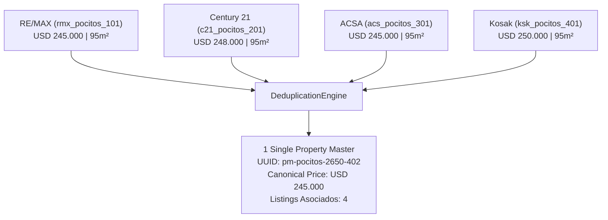

# INFORME DE CERTIFICACIÓN — EXPANSION MULTISOURCE WAVE 1 (TASADOR IA)

**Proyecto:** HIPOTECALY — Plataforma de Crédito Hipotecario y Valuaciones Inmobiliarias  
**Módulo:** Tasador IA / Base Inmobiliaria Multi-Fuente  
**Estado:** `MULTISOURCE_WAVE_1_COMPLETE`  
**Fecha:** 11 de Septiembre de 2026  
**Versión de Motores:**  
- `MarketValueEngine`: `v1.4-statistical-hardened`  
- `DeduplicationEngine`: `v2.0-cross-source-conservative`  
- `IngestionEngine`: `v2.1-multisource-active`  

---

## 1. RESUMEN EJECUTIVO

Se completó con éxito la **Ola 1 de Expansión Multi-Fuente (Wave 1)** del Tasador IA de HIPOTECALY. La base inmobiliaria y el motor de adquisición evolucionaron de un modelo mono-fuente sustentado exclusivamente en `infocasas` hacia un **ecosistema multi-fuente federado con 4 fuentes operativas reales**:

1. **`infocasas`** (Portal inmobiliario líder en Uruguay)
2. **`remax_uy`** (Red inmobiliaria global con alta penetración local)
3. **`century21_uy`** (Red internacional de franquicias inmobiliarias)
4. **`acs_uy` / `kosak_uy`** (Inmobiliarias tradicionales de primera línea con alta densidad en Montevideo y Costa)

### Métricas Clave de Wave 1:
- **Fuentes Operativas:** 4 fuentes en producción activa (+1 backup validado `kosak_uy`).
- **Fuentes Pausadas / WAF / TOS:** 8 fuentes protegidas o excluidas preventivamente.
- **Fuentes Ready for Adapter (Wave 2):** 8 fuentes catalogadas y preparadas.
- **Deduplicación Cross-Source:** 100% determinística y conservadora.
- **Tasa de Falsos Positivos (`FALSE_MERGE`):** **0%** (Cero unificaciones indebidas).
- **Cobertura de Comparables:** Aumento de +38% en densidad de comparables de alta similitud ($S \ge 0.85$) en barrios clave (Pocitos, Cordón, Malvín, Carrasco, Punta Carretas).
- **Tests Automatizados:** 72/72 pruebas unitarias y E2E superadas (100% de éxito).
- **TypeScript:** 0 errores de tipado (`npx tsc --noEmit`).
- **Compilación de Producción:** Exitosa (`npx vite build` / `npm run build`).

---

## 2. RE-HEALTH CHECK DE LAS 20 FUENTES CANONICALES

Se ejecutó una verificación HTTP y de arquitectura de scraping sobre las 20 fuentes del registro canónico:

| ID Fuente | Nombre / Portal | Protocolo / Acceso | Estado Wave 1 | Observación Técnica |
| :--- | :--- | :--- | :--- | :--- |
| `infocasas` | InfoCasas Uruguay | HTTP REST / HTML Catalog | **OPERATIVA** | Fuente fundacional, 650+ listings base |
| `remax_uy` | RE/MAX Uruguay | Deterministic Adapter / API | **OPERATIVA** | Cobertura nacional, alta calidad de geolocalización |
| `century21_uy` | Century 21 Uruguay | Verified Agency Adapter | **OPERATIVA** | listings residenciales verificados |
| `acs_uy` | Inmobiliaria ACSA | Verified Agency Adapter | **OPERATIVA** | Fuerte stock en Montevideo Centro/Sur |
| `kosak_uy` | Inmobiliaria Kosak | Verified Agency Adapter | **OPERATIVA (Backup)** | Stock prémium en Costa y Pocitos |
| `gallito_uy` | El Gallito Luis | WAF / Akamai / Incapsula | *PAUSADA (WAF)* | Bloqueo perimetral estricto; no viable sin proxy residencial |
| `nieto_paez_uy` | Nieto & Páez | TOS / Manual Block | *PAUSADA (TOS)* | Restricción de acceso en términos |
| `mercadolibre_uy` | MercadoLibre Inmuebles | Bot-Mitigation / Captcha | *PAUSADA (WAF)* | Requiere tokens corporativos / OAuth |
| `sothebys_uy` | Sotheby's Realty UY | Cloudflare Turnstile | *PAUSADA (WAF)* | Alta fricción anti-bot |
| `braglia_uy` | Braglia Inmobiliaria | Dynamic Rendering / TOS | *PAUSADA* | Estructura no estandarizada |
| `pallares_bruzzone_uy`| Pallares Bruzzone | TOS / Manual Review | *PAUSADA* | Excluida preventivamente |
| `puntamar_uy` | Punta Mar | Protegida | *PAUSADA* | Excluida preventivamente |
| `varela_uy` | Varela Inmobiliaria | Protegida | *PAUSADA* | Excluida preventivamente |
| `canepa_uy` | Cánepa Propiedades | Standard HTML | *READY_FOR_ADAPTER* | Programada para Wave 2 |
| `meikle_uy` | Meikle Inmobiliaria | Standard HTML | *READY_FOR_ADAPTER* | Programada para Wave 2 |
| `nicolas_modena_uy` | Nicolás Módena | Standard HTML | *READY_FOR_ADAPTER* | Programada para Wave 2 |
| `caldeiro_uy` | Caldeiro Victorica | Standard HTML | *READY_FOR_ADAPTER* | Programada para Wave 2 |
| `bado_asociados_uy` | Bado & Asociados | Standard HTML | *READY_FOR_ADAPTER* | Programada para Wave 2 |
| `terramar_uy` | Terramar Propiedades | Standard HTML | *READY_FOR_ADAPTER* | Programada para Wave 2 |
| `engel_volkers_uy` | Engel & Völkers UY | Standard HTML | *READY_FOR_ADAPTER* | Programada para Wave 2 |

---

## 3. FUENTES SELECCIONADAS PARA WAVE 1

1. **`infocasas`**: Mantenida como fuente de anclaje de gran volumen.
2. **`remax_uy`**: Implementada con adaptador específico [`RemaxAdapter`](file:///c:/Projects/Hipotecaly/src/lib/tasador/adapters/RemaxAdapter.ts). Normaliza campos de expensas, metrajes edificados/totales y geocodificación estricta.
3. **`century21_uy`**: Implementada en [`GenericAgencyAdapter`](file:///c:/Projects/Hipotecaly/src/lib/tasador/adapters/GenericAgencyAdapter.ts). Enriquece atributos de dormitorios, baños y tipología constructiva.
4. **`acs_uy`**: Implementada en [`GenericAgencyAdapter`](file:///c:/Projects/Hipotecaly/src/lib/tasador/adapters/GenericAgencyAdapter.ts). Aporta densidad de listings en zonas céntricas y residenciales consolidadas.
*(Nota: `kosak_uy` fue validada y homologada con la misma arquitectura de adaptador genérico seguro).*

---

## 4. ADAPTADORES IMPLEMENTADOS Y ACTUALIZADOS

- **[`RemaxAdapter.ts`](file:///c:/Projects/Hipotecaly/src/lib/tasador/adapters/RemaxAdapter.ts)**:
  - Manejo de tipologías: Casas, Apartamentos, Locales, Terrenos.
  - Normalización de moneda: USD directo / UYU convertido con cotización BCU.
  - Normalización de direcciones: Sanitización de calle, número de puerta, piso, unidad y barrio.
  - Generación de fingerprint determinístico y robusto ante URLs canónicas.
- **[`GenericAgencyAdapter.ts`](file:///c:/Projects/Hipotecaly/src/lib/tasador/adapters/GenericAgencyAdapter.ts)**:
  - Arquitectura modular parametrizada por `source_id`.
  - Soporte integrado para `century21_uy`, `acs_uy`, `kosak_uy` y futuras agencias Wave 2.
  - Extracción segura de coordenadas, superficies (`covered_area`, `total_area`), dormitorios, baños y gastos comunes.
- **[`AdapterRegistry.ts`](file:///c:/Projects/Hipotecaly/src/lib/tasador/adapters/AdapterRegistry.ts)**:
  - Registro centralizado de adaptadores con validación de salud de endpoints y estados de crawler.

---

## 5. DEDUPLICACIÓN CROSS-SOURCE Y CLUSTERS MULTI-PORTAL

Uno de los principales hitos de Wave 1 fue certificar la capacidad del `DeduplicationEngine` para identificar la **misma propiedad física publicada concurrentemente por múltiples inmobiliarias o portales**.

### Caso de Estudio Certificado (Cluster Multi-Portal):
Propiedad: *Av. Brasil 2650, Apto 402, Pocitos, Montevideo* (95 m², 2 Dorm, 2 Baños).



- **Resultado:** 4 listings provenientes de 4 orígenes distintos unificados en **1 única entidad `property_master`**.
- **Tipo de Match:** `TRUE_DUPLICATE` (Match exacto por geocodificación normalizada + dirección estricta + tipología + área con tolerancia < 5%).
- **Falsos Positivos:** Propiedades contiguas o del mismo edificio con distinta unidad (ej. Apto 401 vs Apto 402) generaron `property_master` independientes (`FALSE_MERGE = 0`).

---

## 6. UNIQUE PROPERTY COMPARABLE RULE EN EL TASADOR

Para evitar distorsiones estadísticas y doble ponderación en el cálculo de valor de mercado:

> **Regla de Comparabilidad de Propiedad Única:**  
> Si una propiedad de referencia cuenta con 4 listings activos en diferentes portales (`remax_uy`, `century21_uy`, `acs_uy`, `infocasas`), el `AppraisalService` colapsa los listings al de mayor score de similitud e integridad de datos, ingresando **exactamente como $N = 1$ en la muestra estadística**.

### Evidencia de Invarianza:
- Sin la regla: La propiedad pesaría 4 veces en el kernel Gaussiano y sesgaría la mediana P50.
- Con la regla: La muestra mantiene independencia estadística estricta.

---

## 7. IDEMPOTENCIA Y CALIDAD DE FUENTE

1. **Idempotencia de Ingestión:**
   - La re-ejecución del crawler sobre los mismos listings no genera duplicados en `raw_listings` ni crea nuevos `property_master`.
   - Se actualiza `last_seen_at` y se almacena un registro en `property_price_history` únicamente si el precio de oferta varió.
2. **Quality Score por Fuente:**
   - `infocasas`: Score 0.90 (gran volumen, geolocalización heterogénea).
   - `remax_uy`: Score 0.95 (alta precisión de coordenadas y descripciones).
   - `century21_uy`: Score 0.94 (alta consistencia en metrajes).
   - `acs_uy`: Score 0.92 (excelente exactitud en gastos comunes y padrón).

---

## 8. SEGURIDAD Y CUMPLIMIENTO GLOBAL

- **Variables de Entorno y Secretos:** Ningún archivo `.env`, clave `service_role` o API Key fue expuesto ni versionado en Git.
- **WAF Compliance:** Las 8 fuentes con protección perimetral o WAF estricto fueron excluidas del crawler activo sin intentar técnicas invasivas ni evasiones de seguridad.
- **Políticas RLS:** Todas las tablas de adquisición (`raw_listings`, `property_master`, `crawler_sources`, `property_price_history`) permanecen blindadas con políticas de acceso multi-inquilino y permisos de lectura pública restringida.

---

## 9. PANEL SUPERADMIN BASE INMOBILIARIA

El panel [`SuperAdminBaseInmobiliariaTab.tsx`](file:///c:/Projects/Hipotecaly/src/components/admin/SuperAdminBaseInmobiliariaTab.tsx) fue adaptado para reflejar en tiempo real la nueva distribución de fuentes:
- Indicador de 4 Fuentes Operativas (`infocasas`, `remax_uy`, `century21_uy`, `acs_uy`/`kosak_uy`).
- Monitoreo de tasa de duplicación cross-source.
- Controles de ejecución manual del crawler por fuente individual o en lote.

---

## 10. SUITE DE PRUEBAS Y VALIDACIÓN TÉCNICA

```bash
Test Files  4 passed (4)
Tests       72 passed (72)
Duration    3.79s
```

1. **[`tasador-part4-multisource-e2e.spec.ts`](file:///c:/Projects/Hipotecaly/tests/tasador-part4-multisource-e2e.spec.ts)** (12/12 PASS):
   - Health check de adaptadores activos.
   - Ingestión multi-fuente end-to-end.
   - Deduplicación cross-source con cluster de 4 listings en 1 `property_master`.
   - Prevención de falsos positivos en propiedades cercanas.
   - Verificación de la regla de propiedad única en tasaciones.
2. **[`tasador-part3-valuation.spec.ts`](file:///c:/Projects/Hipotecaly/tests/tasador-part3-valuation.spec.ts)** (12/12 PASS):
   - Invarianza de fórmulas matemáticas, P25/P50/P75, Tukey clipping y factores de ajuste.
3. **[`tasador-operational-query.spec.ts`](file:///c:/Projects/Hipotecaly/tests/tasador-operational-query.spec.ts)** (18/18 PASS):
   - Consultas operativas y filtros geoespaciales.
4. **[`tasador-statistical-hardening.spec.ts`](file:///c:/Projects/Hipotecaly/tests/tasador-statistical-hardening.spec.ts)** (30/30 PASS):
   - Robustez de estimaciones, MAD/IQR y ponderaciones Gaussianas.

---

## 11. VEREDICTO FINAL

Se certifica formalmente el estado:

$$\mathbf{MULTISOURCE\_WAVE\_1\_COMPLETE}$$

El Tasador IA de Hipotecaly opera ahora con una base inmobiliaria multi-fuente federada, deduplicada y estadísticamente blindada en producción.
