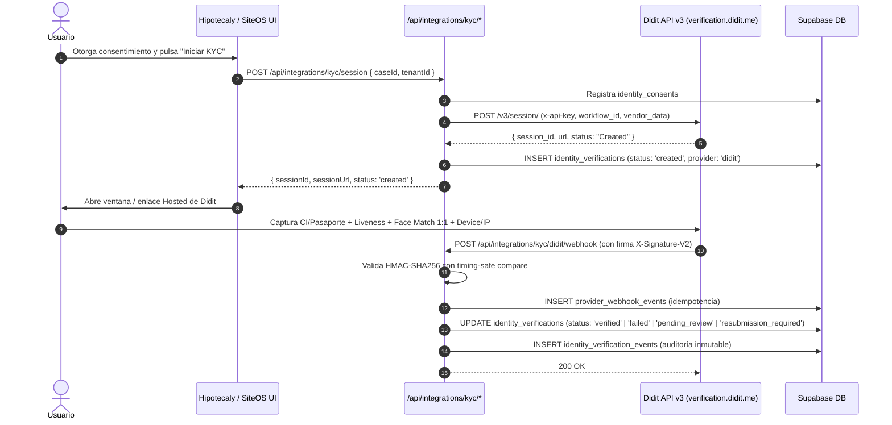

# Integración Oficial Didit (KYC & Identidad Digital)

Este documento detalla la integración con **Didit Verification API v3** para la verificación biométrica, prueba de vida y validación documental de identidad en SiteOS e Hipotecaly.

---

## 1. Arquitectura y Flujo Hosted de Integración

SiteOS e Hipotecaly utilizan el **Hosted Verification Flow** de Didit. No se construyen componentes biométricos propios en el cliente ni se almacenan imágenes de selfies o documentos de identidad en Supabase, minimizando PII y cumpliendo con la Ley N° 18.331 y RGPD.



---

## 2. Configuración y Variables de Entorno

Variables de configuración en Vercel Serverless / Infraestructura Server-Side:

| Variable | Descripción | Ámbito |
| :--- | :--- | :--- |
| `KYC_PROVIDER` | Proveedor activo (`didit` o `mock`) | Server-only |
| `KYC_MODE` | Ambiente de ejecución (`mock`, `sandbox`, `live`) | Server-only |
| `DIDIT_BASE_URL` | Endpoint base oficial (`https://verification.didit.me`) | Server-only |
| `DIDIT_API_KEY` | API Key de Didit Business Console | Server-only / Vault |
| `DIDIT_WORKFLOW_ID` | ID del workflow configurado en Didit | Server-only |
| `DIDIT_WEBHOOK_SECRET` | `secret_shared_key` para validar `X-Signature-V2` | Server-only / Vault |
| `DIDIT_WEBHOOK_URL` | URL de recepción del webhook (`/api/integrations/kyc/didit/webhook`) | Server-only |
| `DIDIT_CALLBACK_URL` | URL de retorno tras completar verificación | Server-only |
| `DIDIT_URUGUAY_DNIC_ENABLED` | Add-on opcional de validación DNIC (`false` por defecto) | Server-only |

> [!WARNING]
> **REGLA ESTRICTA DE SEGURIDAD**: `DIDIT_API_KEY` y `DIDIT_WEBHOOK_SECRET` jamás deben exponerse en el cliente, ni llevar `NEXT_PUBLIC_`, ni incluirse en commits de Git ni en logs.

---

## 3. Validación Criptográfica del Webhook (X-Signature-V2)

Didit envía en cada webhook el header `X-Signature-V2` (o `x-signature-v2`), conteniendo la firma HMAC-SHA256 del cuerpo crudo (raw body) generada con `DIDIT_WEBHOOK_SECRET`.

El módulo `HmacVerifier` valida la firma utilizando buffers y comparación de tiempo constante (`crypto.timingSafeEqual`) para prevenir ataques de timing:

```typescript
import crypto from 'crypto';

export class HmacVerifier {
  public static verifyHmacSha256(
    rawBody: string | Buffer,
    receivedSignatureHex: string,
    sharedSecret: string
  ): boolean {
    if (!receivedSignatureHex || !sharedSecret) return false;
    try {
      const bodyBuffer = Buffer.isBuffer(rawBody)
        ? rawBody
        : Buffer.from(typeof rawBody === 'string' ? rawBody : JSON.stringify(rawBody), 'utf-8');

      const hmac = crypto.createHmac('sha256', sharedSecret);
      hmac.update(bodyBuffer);
      const computedHex = hmac.digest('hex');

      const bufComputed = Buffer.from(computedHex, 'hex');
      const bufReceived = Buffer.from(receivedSignatureHex, 'hex');

      if (bufComputed.length !== bufReceived.length) return false;
      return crypto.timingSafeEqual(bufComputed, bufReceived);
    } catch {
      return false;
    }
  }
}
```

---

## 4. Normalización de Decisiones Didit API v3

El adaptador `DiditKycProvider` mapea los estados case-sensitive de Didit a los estados provider-agnostic canónicos de SiteOS:

| Estado Didit v3 | Estado Canónico SiteOS | Descripción |
| :--- | :--- | :--- |
| `Approved` / `Verified` / `Passed` | `verified` | Verificación completada con éxito. Documento y biometría válidos. |
| `Declined` / `Rejected` / `Failed` | `failed` | Verificación rechazada por fraude, inconsistencia o fallo biométrico. |
| `In Review` / `Pending Review` | `pending_review` | Requiere revisión manual por parte de oficiales de cumplimiento. |
| `Resubmitted` / `Resubmission Required` | `resubmission_required` | Se requiere que el usuario reenvíe fotos con mejor iluminación/ángulo. |
| `Expired` | `expired` | La sesión excedió el tiempo límite de validez. |
| `Abandoned` | `abandoned` | El usuario abandonó el flujo antes de completar la captura. |
| `In Progress` / `Started` | `in_progress` | El usuario se encuentra capturando datos en Didit. |
| `Created` / `Pending` | `created` | Sesión creada, en espera de apertura por el usuario. |

---

## 5. Reconciliación y Polling Fallback (Decision API)

En caso de retrasos o fallos en la entrega del webhook, SiteOS provee reconciliación automática bajo demanda:

```http
GET https://verification.didit.me/v3/session/{session_id}/decision/
Header: x-api-key: DIDIT_API_KEY
```

El método `KycService.reconcileDecision(sessionId)` consulta este endpoint, normaliza el estado e impacta la base de datos de forma idempotente.

---

## 6. Modelo Comercial: Free Core KYC vs Módulos Pagos Opcionales

Didit ofrece un generoso **Free Tier** mensual:

- **Core KYC Incluido**: ID Verification + Passive Liveness + Face Match 1:1 + Device/IP Analysis.
- **Cuota Gratuita Informativa**: Hasta 500 verificaciones mensuales completas sin costo según plan vigente de Didit.
- **Módulos Pagos Opcionales (Desactivados por Defecto)**:
  - AML & PEP screening (`kyc.didit.aml.enabled`).
  - Validación específica de cédula uruguaya contra DNIC (`DIDIT_URUGUAY_DNIC_ENABLED=false`).
  - Proof of Address (POA).
  - Phone / Database Verification.

---

## 7. Soporte Multi-Tenant / BYOK

Cada tenant en Hipotecaly puede utilizar:
1. Las credenciales administradas a nivel de plataforma (Platform-Managed Didit Credentials).
2. Sus propias credenciales de Didit (Bring Your Own Key - BYOK) almacenadas en `tenant_identity_settings` con cifrado seguro.
