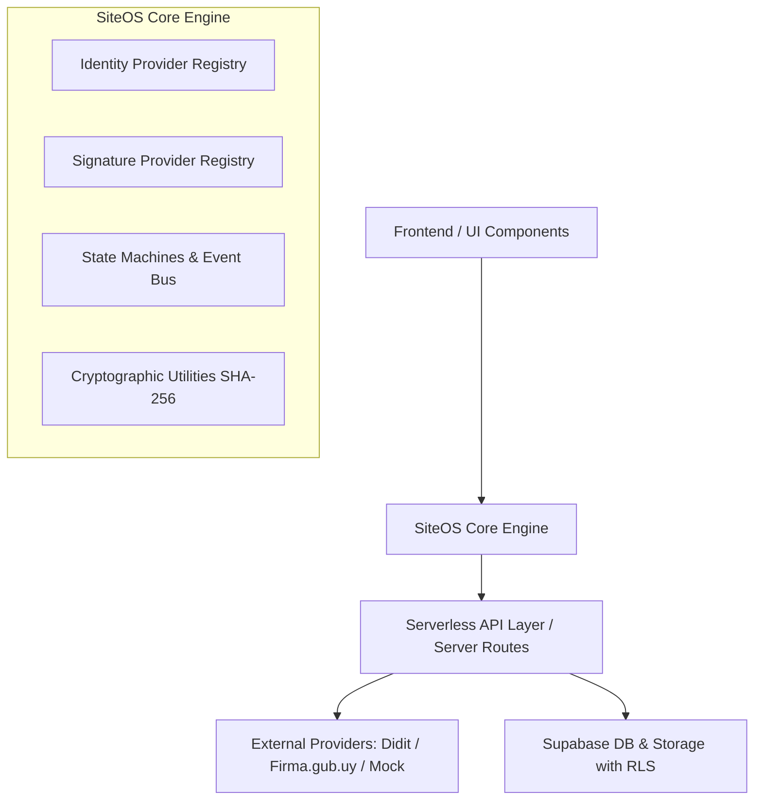
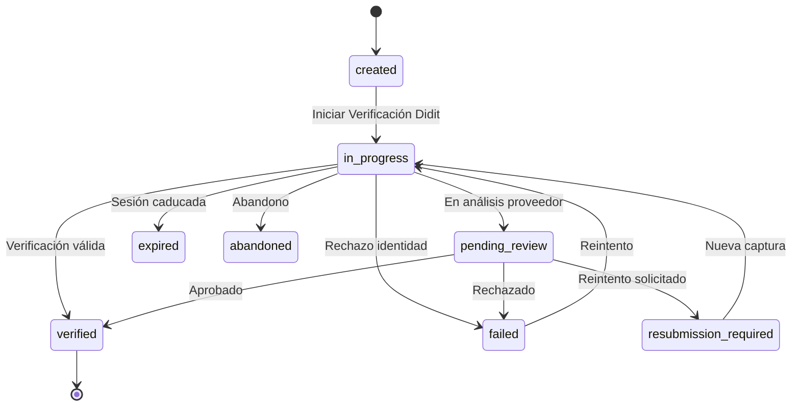

# Módulo Universal de Identidad, KYC y Firma Digital (SiteOS)

Sistema modular, multi-tenant, seguro y desacoplado para la verificación de identidad (KYC), emisión de consentimientos, auditoría criptográfica y firma digital avanzada.

Diseñado como infraestructura reutilizable bajo el estándar **SiteOS**, operable tanto en **Hipotecaly** como en cualquier otra aplicación web o SaaS basada en TypeScript y Supabase.

---

## 1. Arquitectura General

El módulo se estructura en 4 capas desacopladas:

### Principios Fundamentales
1. **Zero Secret Leaks**: Ningún secreto (`DIDIT_API_KEY`, `DIDIT_WEBHOOK_SECRET`, `FIRMA_GUB_BASE_URL`, `SUPABASE_SERVICE_ROLE_KEY`) se empaqueta ni se expone al cliente.
2. **Provider-Agnostic**: Tanto KYC como Firma Digital operan contra interfaces tipadas (`KycProvider`, `SignatureProvider`). Añadir nuevos proveedores (ej. Didit, Sumsub, Persona, Firma.gub) no requiere modificar las vistas ni la base de datos.
3. **Multi-Tenant First**: Toda verificación, firma o configuración pertenece a un `tenant_id` con políticas RLS que aíslan datos estrictamente.
4. **Integridad Criptográfica**: Cada documento a firmar registra su `original_sha256` antes del envío y su `signed_sha256` al completarse, garantizando no repudio y trazabilidad.

---

## 2. Modelos de Datos

### Tablas Principales
- `identity_verifications`: Sesiones y estados de validación de identidad.
- `identity_verification_events`: Log inmutable de auditoría para cada transición de KYC.
- `identity_consents`: Registro legal explícito de consentimientos otorgados por el usuario.
- `signature_processes`: Procesos de firma orquestados (estados, tipo de flujo, metadata).
- `signature_signers`: Firmantes asignados (orden, estado individual, timestamps).
- `signature_documents`: Documentos involucrados con sus hashes SHA-256 originales y firmados.
- `signature_events`: Log inmutable de auditoría para cada paso del proceso de firma.
- `tenant_identity_settings`: Configuración por tenant de proveedores activos y credenciales seguras.
- `provider_webhook_events`: Almacenamiento y control de idempotencia de webhooks entrantes.

---

## 3. Máquinas de Estados

### Máquina de Estados KYC

---

## 4. Guías Detalladas

- [Integración Didit (KYC & Identidad)](./DIDIT.md)
- [Integración Firma.gub.uy / AGESIC (Firma Digital)](./FIRMA_GUB.md)
- [Modo Simulación / Mock](./MOCK.md)
- [Seguridad, Criptografía y RLS](./SECURITY.md)
- [Instalación y Reutilización en otros proyectos (SiteOS)](./SITEOS.md)

